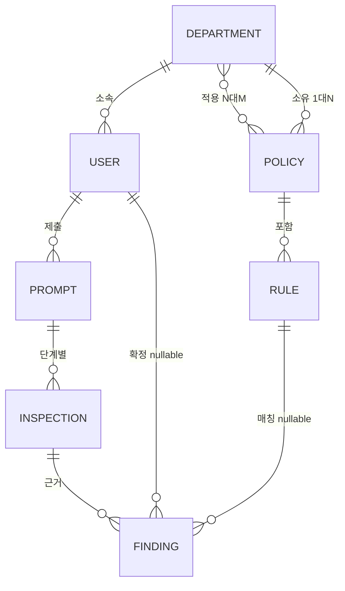
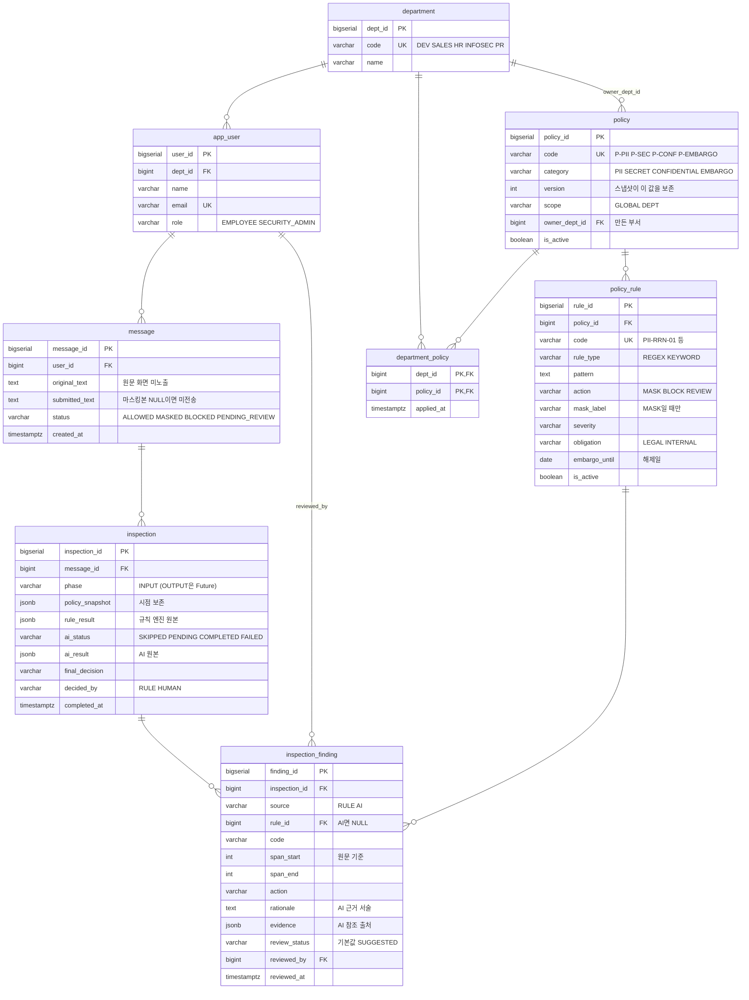

# 02. ERD 설계서

**입력:** [01 데이터 요구사항 정의서](01_데이터요구사항정의서.md) DR-01~DR-22
**출력:** `docs/erd.dbml` (dbdiagram.io 소스) → 이 문서의 도해
**이 문서의 위치:** 요구사항을 **개체와 관계**로 옮기는 단계. 타입·제약은 아직 정하지 않는다(03번의 일).

---

## 1. 개체 도출 — 요구사항에서 명사를 뽑는다

| 요구사항 | 문장에서 반복되는 명사 | 개체 후보 |
|---|---|---|
| DR-01(원문/전송본 분리), DR-18(로그인 없는 사용자 식별) | 사용자가 입력한 프롬프트 | **사용자**, **프롬프트** |
| DR-02(검사 1회=1레코드), DR-07(비동기 AI 상태 추적) | 검사 1회의 결과 | **검사** |
| DR-03(근거를 항목 단위로), DR-04(근거의 출처 구분), DR-05(AI 후보는 확정 전 무효) | 판정의 근거 항목 | **발견 항목** |
| DR-09(기준은 코드가 아니라 데이터), DR-13(규칙 코드가 공통 식별자), DR-14(마스킹 라벨은 MASK에만) | 규칙의 패턴·액션 | **규칙** |
| DR-10(부서별 적용 정책), DR-11(소유 부서≠적용 부서) | 부서마다 다른 정책 | **정책**, **부서** |

여섯 개다. 여기에 DR-10(부서별 적용 정책)의 부서×정책 다대다를 표현할 **연결 개체**가 하나 더 붙어 7개,
DR-03(근거를 항목 단위로)을 검사와 분리하면서 8개가 된다.

---

## 2. 개념 ERD



| 개념 개체 | 우리말 | 이후 테이블명 |
|---|---|---|
| DEPARTMENT | 부서 | `department` |
| USER | 사용자 | `app_user` |
| POLICY | 정책 | `policy` |
| RULE | 규칙 | `policy_rule` |
| PROMPT | 프롬프트 | `message` |
| INSPECTION | 검사 | `inspection` |
| FINDING | 발견 항목 | `inspection_finding` |

부서와 정책 사이에 선이 **두 개**인 것이 이 모델의 특징이다 — DR-11(소유 ≠ 적용)의 직접적 결과다.

---

## 3. 논리 ERD (Core 8)



> dbdiagram.io용 소스는 `docs/erd.dbml`이다. 발표용 PNG는 그 파일을 붙여넣어 export한다.

---

## 4. 관계 정의

| # | 관계 | 카디널리티 | 선택성 | 근거 |
|---|---|---|---|---|
| R1 | department — app_user | 1:N | 사용자는 부서 필수 | 부서가 적용 정책을 결정한다(DR-10 · 부서별 적용 정책). 부서 없는 사용자는 판정 불가 |
| R2 | department — policy (적용) | **N:M** → `department_policy` | 양쪽 선택 | DR-10(부서별 적용 정책) |
| R3 | department — policy (소유) | 1:N | 소유 부서는 선택 | DR-11(소유 부서≠적용 부서). 기존 3개 정책은 나중에 채워졌다 |
| R4 | policy — policy_rule | 1:N | 규칙은 정책 필수 | 정책 없는 규칙은 적용 범위를 결정할 수 없다 |
| R5 | app_user — message | 1:N | 필수 | DR-18(로그인 없는 사용자 식별) |
| R6 | message — inspection | 1:N | 필수 | phase별 1건. 현재 INPUT만이라 사실상 1:1이나, OUTPUT 확장(DR-22 · 확장 지점 논리 표기)을 위해 1:N |
| R7 | inspection — inspection_finding | 1:N | 0건 가능 | 위반이 없으면 findings는 빈 배열 |
| R8 | policy_rule — inspection_finding | 1:N | **nullable** | DR-04(근거의 출처 구분). AI 후보는 규칙을 참조하지 않는다 |
| R9 | app_user — inspection_finding | 1:N | **nullable** | DR-06(사람의 확정 기록). 미검토 항목은 확정자가 없다 |

**R8·R9의 nullable이 이 설계의 핵심이다.** 두 FK가 NULL일 수 있다는 사실이
"규칙 근거"와 "AI 후보"를 한 테이블에 담으면서도 성격을 구분하는 방법이다.

---

## 5. 설계 결정 — 01번이 넘긴 5개 질문에 답한다

### Q1. 원문과 전송본은 한 테이블인가 두 테이블인가 (DR-01 · 원문/전송본 분리)

**한 테이블, 두 컬럼.** `message.original_text` / `message.submitted_text`

| 대안 | 기각 사유 |
|---|---|
| 별도 `masked_message` 테이블 | 1:1 관계를 테이블로 나누면 조회가 항상 조인이다. 두 값의 생명주기가 동일(같은 트랜잭션에서 생기고 함께 사라진다)하므로 분리 이득이 없다 |

`submitted_text IS NULL`의 의미는 **"마스킹본이 만들어진 적이 없다"**이며,
그것은 규칙 BLOCK 경로에서만 발생한다 (D5 · BLOCK이면 마스킹 안 함·D7 · PENDING_REVIEW 본문 보존·D14 · BLOCK⇒NULL은 필요조건).
"차단됐다"는 사실은 `status`가 기록하지 이 컬럼이 기록하지 않는다.

### Q2. 규칙 근거와 AI 후보를 나눌 것인가 합칠 것인가 (DR-03 · 근거를 항목 단위로, DR-04 · 근거의 출처 구분)

**합친다. `source` 컬럼으로 구분한다.**

| 대안 | 기각 사유 |
|---|---|
| `rule_finding` / `ai_finding` 두 테이블 | SCR-02 상세 패널이 두 출처를 **같은 목록 구조**로 그린다. 나누면 화면이 두 번 조회하고 두 형태를 병합해야 하며, 정렬 기준도 애플리케이션으로 올라간다 |

합쳤을 때 생기는 위험은 "AI 후보에 규칙 ID가 붙는 것"인데, 그건 제약으로 막는다(03번 §4).

### Q3. 부서×정책의 카디널리티 (DR-10 · 부서별 적용 정책)

**N:M 연결 테이블 + `policy.scope` 이중 구조.**

```
scope = GLOBAL  →  매핑 없이 전 부서 적용   (P-PII, P-SEC)
scope = DEPT    →  department_policy 매핑 필요 (P-CONF, P-EMBARGO)
```

| 대안 | 기각 사유 |
|---|---|
| `policy.dept_id` 단일 FK | 같은 정책을 부서 수만큼 복제해야 한다. 규칙까지 복제되므로 "규칙 하나 바꾸면 N군데"가 된다 |
| 전 정책을 매핑 테이블로 | 전사 정책까지 매핑 행을 만들면 **부서를 추가할 때 매핑 누락 = 정책 미적용**이 된다. 조용히 뚫린다 |

V3에서 홍보팀을 추가할 때 이 설계가 검증됐다 — `department` 한 행만 넣었는데
P-PII·P-SEC가 자동으로 적용됐고, 매핑 작업은 P-EMBARGO 2행뿐이었다.

`department_policy`의 PK는 **복합 (dept_id, policy_id)**다. 서러게이트 PK를 두면
같은 (부서, 정책) 중복 매핑을 막지 못한다.

### Q4. 시점 보존을 이력 테이블로 할 것인가 스냅샷으로 할 것인가 (DR-15 · 정책 버전 시점 보존)

**`policy.version` + `inspection.policy_snapshot` 스냅샷.**

| 대안 | 판단 |
|---|---|
| `policy_audit` 이력 테이블 | 정확하지만, 정책 편집 UI가 범위 밖(0.3)이라 **이력을 만들 주체가 없다**. 빈 테이블을 만드는 셈 |
| 스냅샷 | 판정 시점에 `{policyId, code, version, ruleCodes[]}`를 통째로 박는다. 정책이 나중에 바뀌어도 그때의 판단 근거가 남는다 |

정규화 원칙으로는 중복이지만, **감사 데이터의 시점 보존은 의도적 비정규화가 정답이다.**
원본은 `policy`·`policy_rule`에 정규화되어 있고, JSONB는 그 시점의 사본이다.
`policy_audit`은 Future로 남긴다(DR-22 · 확장 지점 논리 표기).

### Q5. "스키마 변경 없이" AI 응답을 보관하는 타입 (DR-19 · 스키마 변경 없이 AI 응답 보관)

**JSONB 3개** — `policy_snapshot`, `rule_result`, `ai_result` (+ `finding.evidence`)

| 대안 | 기각 사유 |
|---|---|
| AI 응답 필드를 컬럼으로 전개 | 실제 LLM 교체 시 응답 스키마가 늘어난다. 그때마다 마이그레이션이 필요하면 "AI-Ready"가 거짓말이 된다 |
| TEXT에 JSON 문자열 | 조회·검증이 불가능하고, 타입 있는 객체로 왕복하지 못한다 |

이 세 컬럼이 발표에서 **AI-Ready 원칙 "Structured Data"의 물증**이다.

---

## 6. 정규화 수준

Core 8 테이블은 **제3정규형(3NF)**을 만족한다. 의도적 예외는 아래 세 곳뿐이다.

| 위치 | 형태 | 정당화 |
|---|---|---|
| `inspection.policy_snapshot` | 정책·버전·규칙코드의 중복 사본 | **시점 보존**(DR-15 · 정책 버전 시점 보존). 원본이 바뀌어도 과거 판정이 흔들리면 안 된다 |
| `inspection.rule_result` / `ai_result` | 엔진·AI 응답 원본 | **스키마 무변경 확장**(DR-19 · 스키마 변경 없이 AI 응답 보관). 파생 값은 `inspection_finding`에 정규화되어 함께 존재한다 |
| `inspection_finding.code` | `policy_rule.code`의 사본 | AI 후보는 `rule_id`가 NULL이라 코드를 자체 보유해야 한다. 규칙 finding에서는 중복이지만 두 출처의 컬럼 구조를 통일하는 대가다 |

부분 함수 종속·이행 종속은 없다. `department_policy`의 복합 PK에 딸린 비키 속성은
`applied_at` 하나이며 PK 전체에 완전 종속한다.

---

## 7. Future Domain (Logical only) — DR-22(확장 지점 논리 표기)

DDL을 실행하지 않고 `docs/erd.dbml`에만 표기한다. 확장 지점을 그림으로 보여주되 범위(0.3)는 지킨다.

| 테이블 | 연결 | 무엇을 대비하는가 |
|---|---|---|
| `attachment` | `message` 1:N | 첨부파일 메타. 텍스트 추출 후 **같은 규칙 엔진**에 태운다 |
| `knowledge_source` | AiInspector 입력 | 기밀 사전·NDA 목록. 현재 KEYWORD 패턴이 하는 일을 RAG 검색으로 대체 |
| `policy_audit` | `policy` 1:N | 정책 변경 이력. 현재는 Q4의 스냅샷으로 대체 |
| `ai_provider_config` | 독립 | 모델별 파라미터. 현재는 `application.yml` + 환경변수 (11.3) |

**발표 문장:** "확장 지점은 상상이 아니라 ERD에 자리로 그려져 있고, 각각이 어떤 현재 구현을 대체하는지 대응이 있습니다."

---

## 8. 다음 단계로 넘기는 것

03번 스키마 설계서가 결정할 것:
1. 각 컬럼의 타입과 길이
2. R8·R9의 nullable을 악용한 잘못된 행을 **무엇으로 막을 것인가** (Q2의 미결)
3. DR-20(값 집합 DB 강제)을 CHECK로 할 것인가 ENUM 타입으로 할 것인가
4. DR-16(감사 목록 필터·정렬)의 조회 패턴에 필요한 인덱스
